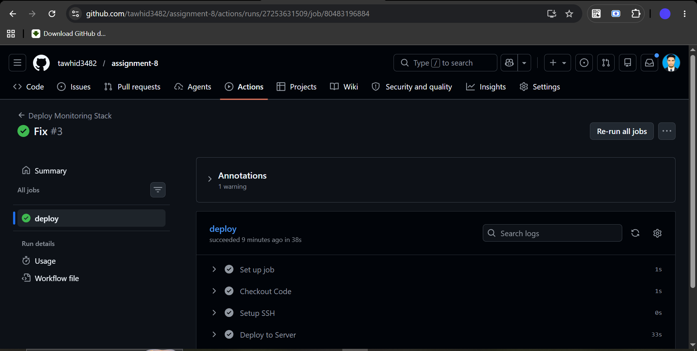
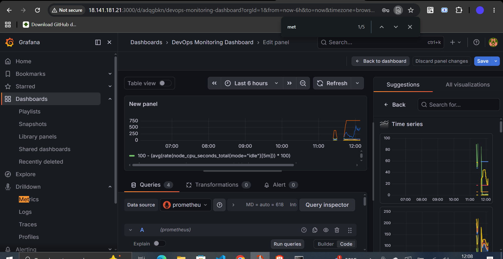
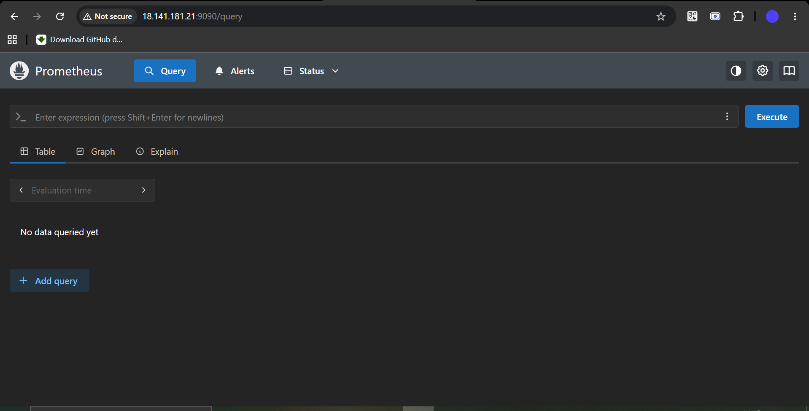
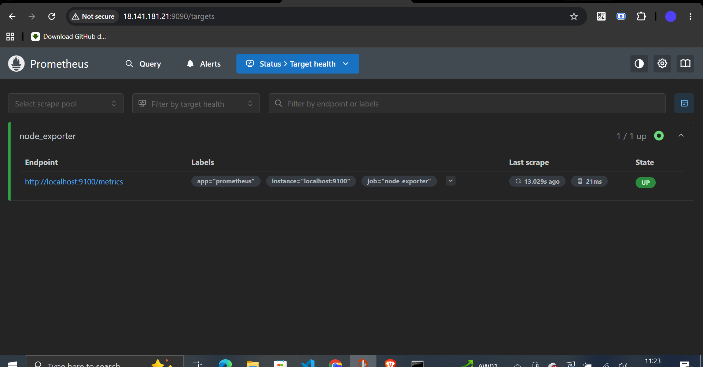
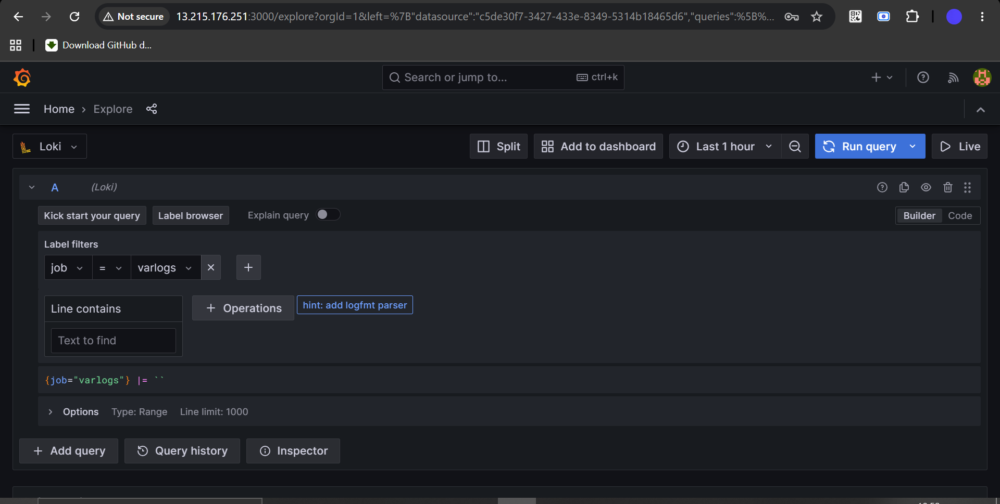
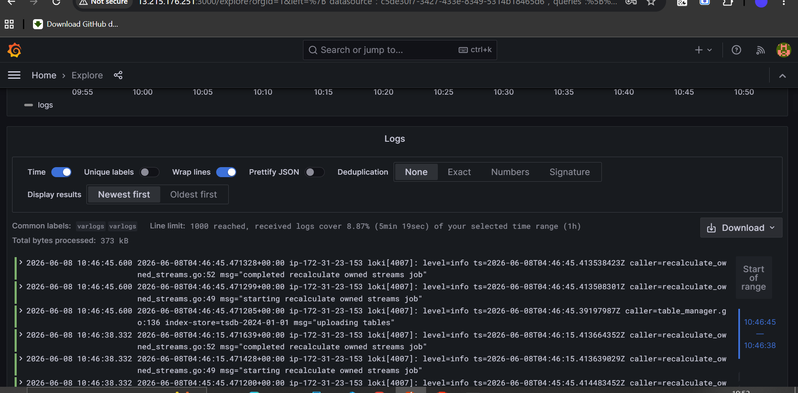

# DevOps Monitoring & Deployment Project

## 🚀 Tech Stack
- Terraform (Infrastructure provisioning)
- GitHub Actions (CI/CD)
- Grafana (Visualization)
- Loki (Logging)
- Promtail (Log shipping)
- Node Exporter (System metrics)
- Prometheus (Metrics collection)

---

## 📦 Setup Steps

### 1. Terraform
```bash
cd terraform
terraform init
terraform apply
```

### 2. CI/CD
Push code to GitHub → automatic deployment triggers via GitHub Actions.

### 3. Install Monitoring Stack
```bash
bash monitoring/install.sh
bash scripts/setup-node-exporter.sh
```

---

## 📊 Access

| Service    | URL                          |
|------------|------------------------------|
| Grafana    | `http://<server-ip>:3000`    |
| Prometheus | `http://<server-ip>:9090`    |

---

## 📷 Screenshots

### GitHub Actions — CI/CD Pipeline Success


### Grafana — DevOps Monitoring Dashboard


### Prometheus — Query Interface


### Prometheus — Node Exporter Target Health


### Loki — Log Query (Explore)


### Loki — Log Output


---

## 👨‍💻 Author

DevOps Project by **Tawhidul Islam**

---
